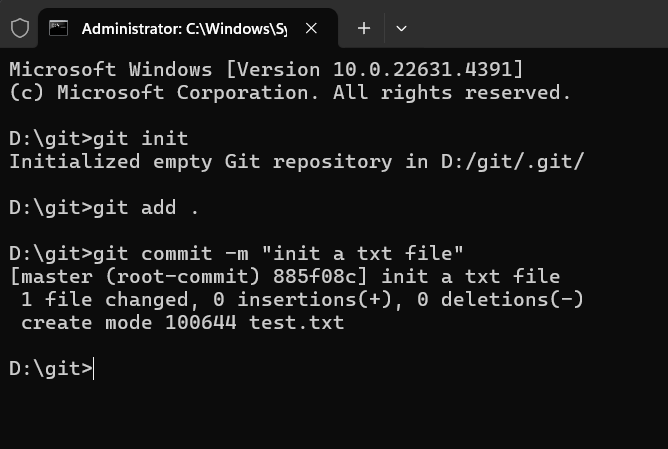
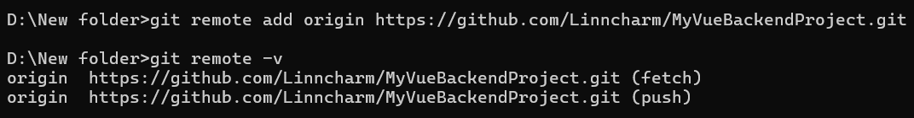
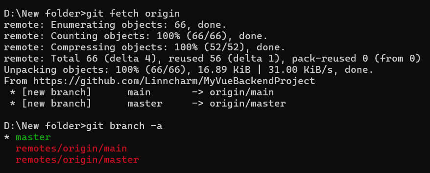
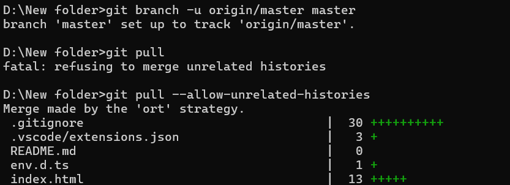
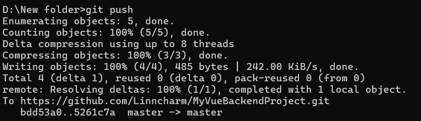
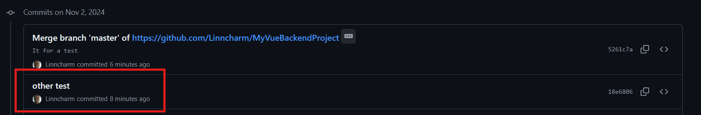

# It is a Git guideline for myself 🤔

# There are **Three** part of it 
- **🔗Build a connect from Local to Remote** 
- **📖Clone repo from Remote to Local** 
- **💡Some little tip about git** 
## 🔴Part 1. Build a connect from Local to Remote
 
## First: creat a work directory and init it
- 1. Creat a directory and name it anything you want
- 2. Enter the cmd window and run this command
```shell
   git init
```
- 3. Create a file or move code file in it, then add all this to buffer zone 
```shell
   touch test.txt
   git add .
```
- 4. Then make a commit to my local repo
```shell
   git commit -m "xxxx"                   xxxx is the remark to the change 
```

- 5. Add the remote repo and name it, then use [-v] to check the detail 
```shell
   git remote add origin [URL]
   git remote -v
```
```
   ATTENTION!!! always use origin as the name of repo
```

- 6. Get the remote repo information and check the branch
```shell
    git fetch origin
    git branch -a
```

- 7. Make a tracking branch as prepare work
```shell
    git branch -u origin/master master 
    
    ---the first param is remote while the second is local---
```
```shell
    git branch -vv      [check the tracking information]
```
- 8. Then pull the repo to update branch
```shell
    git pull --allow-unrelated-histories
```

- 9. At last directly push the commit the remote repo (Since tracking has been set in step 7)
```shell
    git push
```

- 10. 🤩 It can be checked on the repo commit column


## 🔴Part 2. Clone from remote repo and build cooperation
- 1. Creat a directory and name it anything you want
- 2. Enter the cmd window and run this command
```shell
    git clone [URL]
```
It will creat a .git directory with git configure in secret, and initialize it at the same time
- 3. Then the repo can be successfully download
## 🔴Part 3. Some useful tips about git
### 1. The operation of <u>branch</u>
